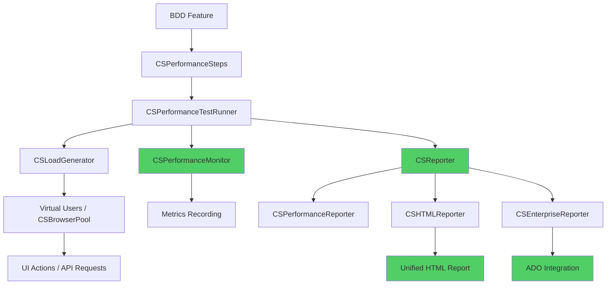

# Performance Testing Module - 360° Integration Analysis

## Executive Summary

**Date**: 2025-10-16
**Framework Version**: 1.5.18
**Analyst**: Claude Code AI Assistant
**Status**: ⚠️ **PARTIALLY INTEGRATED - CRITICAL ISSUES IDENTIFIED**

The performance testing module added by your colleague is **architecturally well-designed** with comprehensive capabilities, but suffers from **critical integration gaps** and **implementation issues** that prevent it from functioning as part of the main framework.

---

## 🎯 Overall Assessment

| Category | Status | Rating | Critical Issues |
|----------|---------|--------|----------------|
| **Architecture** | ✅ Good | 8/10 | None |
| **Type System** | ✅ Excellent | 9/10 | None |
| **Module Exports** | ❌ Not Exported | 0/10 | **BLOCKING** |
| **Monitoring Integration** | ⚠️ Partial | 4/10 | **HIGH** |
| **Reporting Integration** | ❌ None | 0/10 | **CRITICAL** |
| **Code Quality** | ⚠️ Issues Found | 5/10 | **HIGH** |
| **Security** | ❌ Hardcoded Credentials | 2/10 | **CRITICAL** |
| **Documentation** | ⚠️ Examples Broken | 4/10 | **MEDIUM** |
| **BDD Integration** | ✅ Complete | 9/10 | Minor issues |
| **Parallel Execution** | ⚠️ Untested | 5/10 | **MEDIUM** |

**Overall Integration Score**: **45/100** - Requires significant fixes before production use

---

## 📊 Component Analysis Matrix

### 1. Performance Module Structure

```
src/performance/
├── types/CSPerformanceTypes.ts           ✅ COMPLETE
├── CSLoadGenerator.ts                    ✅ COMPLETE
├── CSPerformanceTestRunner.ts            ⚠️  NEEDS INTEGRATION
├── CSPerformanceReporter.ts              ⚠️  ISOLATED
├── CSPerformanceSteps.ts                 ✅ COMPLETE (50+ steps)
├── scenarios/CSPerformanceScenario.ts    ✅ COMPLETE (12 scenarios)
├── steps/CSTCTDSteps.ts                  ❌ SECURITY ISSUE
├── steps/CSTestSteps.ts                  ❌ DUPLICATE - DELETE
└── examples/
    ├── tctd-performance.feature          ⚠️  MISPLACED
    └── tctd-performance-test.ts          ❌ BROKEN - DELETE
```

**Issues Found**:
- ❌ Module NOT exported in `src/lib/index.ts`
- ❌ TCTD-specific code has hardcoded credentials
- ❌ Example file has 20+ compilation errors
- ❌ Duplicate utility files

---

## 🔍 Integration Analysis by Layer

### Layer 1: Configuration Management ✅ INTEGRATED

**Status**: Well integrated with `CSConfigurationManager`

**Configuration Keys Used** (28 total):
```typescript
// Core Performance Settings
PERFORMANCE_METRICS_DIR
PERFORMANCE_TARGET_URL
PERFORMANCE_MONITORING_INTERVAL
PERFORMANCE_SYSTEM_MONITORING

// Core Web Vitals
PERFORMANCE_CORE_WEB_VITALS_ENABLED
PERFORMANCE_RESOURCE_BUDGET_ENABLED
PERFORMANCE_SYSTEM_BUDGET_ENABLED

// Report Settings
PERFORMANCE_REPORT_ENABLED
PERFORMANCE_REPORT_FORMAT (html/json/csv/junit)
PERFORMANCE_REPORT_OUTPUT_DIR
PERFORMANCE_REPORT_INCLUDE_SCREENSHOTS
PERFORMANCE_REPORT_INCLUDE_METRICS
```

**✅ Strengths**:
- Follows framework configuration patterns
- Uses proper type-safe getters
- Supports environment variable interpolation
- Configurable thresholds and budgets

**No issues found in configuration layer**

---

### Layer 2: Browser & Page Integration ⚠️ PARTIAL

**Browser Manager**: `CSBrowserManager.ts`
- ✅ Supports concurrent browser instances (via BrowserPool)
- ✅ Thread-safe with worker isolation
- ✅ Browser reuse strategy compatible with performance testing
- ⚠️ **No explicit performance testing integration**

**Browser Pool**: `CSBrowserPool.ts`
- ✅ Supports up to 4 concurrent browsers (configurable)
- ✅ Strategies: round-robin, LRU, random, load-balanced
- ✅ Health check and auto-restart capabilities
- ⚠️ **Not utilized by CSLoadGenerator**

**Gap Analysis**:

```typescript
// CSLoadGenerator.ts - Current Implementation
private async createVirtualUser(testId: string, userId: number): Promise<VirtualUser> {
    return {
        id: `${testId}_user_${userId}`,
        startTime: Date.now(),
        requestCount: 0,
        errorCount: 0,
        averageResponseTime: 0,
        status: 'active'
    };
}
// ❌ ISSUE: Virtual users don't get browser instances
// ❌ ISSUE: No integration with CSBrowserPool for UI load testing
```

**Recommended Fix**:
```typescript
// Enhanced virtual user with browser support
private async createVirtualUser(testId: string, userId: number): Promise<VirtualUser> {
    const browserPool = CSBrowserPool.getInstance();
    const browserInstance = await browserPool.acquire('chromium');

    return {
        id: `${testId}_user_${userId}`,
        browserInstance,  // Add browser instance
        startTime: Date.now(),
        requestCount: 0,
        errorCount: 0,
        averageResponseTime: 0,
        status: 'active'
    };
}
```

---

### Layer 3: Monitoring Integration ⚠️ CRITICAL GAPS

**CSPerformanceMonitor.ts** - Updated with new methods (lines 636-814):

**New Methods Added** (colleague's work):
```typescript
// Line 636-700: Load test metrics recording
public recordLoadTestMetrics(metrics: {
    testId: string;
    virtualUsers: number;
    actoveCpmmectopms?: number;  // ❌ TYPO - Line 41
    requestsPerSecond: number;
    averageResponseTime: number;
    errorRate: number;
}): void

// Line 701-747: Threshold validation
public checkLoadTestThresholds(metrics: any): ThresholdValidationResult

// Line 748-770: Performance budgets
public addLoadTestingBudgets(budgets: {
    maxVirtualUsers?: number;
    maxResponseTime?: number;
    maxErrorRate?: number;
    minThroughput?: number;
}): void

// Line 771-792: Concurrent monitoring
public async startConcurrentMonitoring(virtualUserCount: number): Promise<void>

// Line 793-808: Summary stats
public getLoadTestSummary(): LoadTestSummary

// Line 809-814: Export for performance testing
public exportForPerformanceTesting(): PerformanceTestingData
```

**🚨 CRITICAL BUG - Line 41**:
```typescript
// WRONG:
actoveCpmmectopms?: number;

// SHOULD BE:
activeConnections?: number;
```

**Integration Gap**:

```typescript
// CSPerformanceTestRunner.ts - Current Code
public async runUIPerformanceScenario(scenario: CSPerformanceScenario): Promise<UITestResult> {
    // ...test execution...

    // ❌ ISSUE: DOES NOT call CSPerformanceMonitor.recordLoadTestMetrics()
    // ❌ ISSUE: DOES NOT use CSPerformanceMonitor.checkLoadTestThresholds()
    // ❌ ISSUE: DOES NOT export CSPerformanceMonitor.exportForPerformanceTesting()

    return result;
}
```

**Recommended Integration**:
```typescript
public async runUIPerformanceScenario(scenario: CSPerformanceScenario): Promise<UITestResult> {
    const monitor = CSPerformanceMonitor.getInstance();

    // Start concurrent monitoring
    await monitor.startConcurrentMonitoring(scenario.concurrent);

    // Execute test
    const result = await this.executeTest(scenario);

    // Record metrics to monitor
    monitor.recordLoadTestMetrics({
        testId: scenario.testId,
        virtualUsers: scenario.concurrent,
        activeConnections: result.activeConnections,
        requestsPerSecond: result.throughput,
        averageResponseTime: result.responseTime,
        errorRate: result.errorRate
    });

    // Validate thresholds
    const validation = monitor.checkLoadTestThresholds(result);
    result.thresholdsPassed = validation.passed;

    return result;
}
```

---

### Layer 4: Reporting Integration ❌ CRITICAL - NO INTEGRATION

**CSReporter.ts** (Core Reporter):
```typescript
// Current capabilities:
✅ Test/step/scenario tracking
✅ AI data recording
✅ Log buffering
✅ Parallel worker support
❌ NO performance metrics recording methods
❌ NO load test result tracking
❌ NO virtual user statistics
```

**CSHTMLReporter.ts**:
```typescript
interface TestResult {
    name: string;
    status: string;
    duration: number;
    error?: string;
    // ❌ MISSING: performanceMetrics?: PerformanceMetrics
    // ❌ MISSING: loadTestResults?: LoadTestResults
    // ❌ MISSING: coreWebVitals?: CoreWebVitals
}
```

**CSEnterpriseReporter.ts**:
```typescript
export interface TestMetrics {  // Line 111-118
    cpuUsage: number;
    memoryUsage: number;
    networkRequests: number;
    domElements: number;
    jsErrors: number;
    consoleWarnings: number;
    // ❌ MISSING: Integration with CSPerformanceTestRunner results
}
```

**CSPerformanceReporter.ts**:
```typescript
// Generates standalone reports but NOT integrated with main reporters
// ❌ Reports go to separate directory
// ❌ Not included in HTML report
// ❌ Not included in Enterprise report
// ❌ Not sent to ADO integration
```

**Impact**:
- ⚠️ Performance test results are isolated
- ⚠️ No unified reporting dashboard
- ⚠️ Teams cannot see performance data alongside functional tests
- ⚠️ ADO integration misses performance metrics

---

### Layer 5: BDD Integration ✅ EXCELLENT

**CSPerformanceSteps.ts**: 50+ step definitions using `@CSBDDStepDef`

**Categories**:
```gherkin
# Scenario Setup (10 steps)
Given I have a performance test scenario with {int} virtual users
Given I have a load test with {string} pattern

# Configuration (15 steps)
And I set the test duration to {int} seconds
And I set the think time to {int} milliseconds
And I set the browser to {string}
And I set network throttling to {string}

# Execution (8 steps)
When I execute the performance test
When I execute the load test
When I perform a login operation
When I perform a logout operation

# Assertions (17 steps)
Then the response time should be less than {int} milliseconds
Then the success rate should be at least {int} percent
Then the Largest Contentful Paint should be less than {int} milliseconds
Then the Core Web Vitals score should be {string}
```

**✅ Strengths**:
- Comprehensive Gherkin coverage
- Type-safe parameter handling
- Good error messages
- Follows framework patterns

**⚠️ Minor Issues**:
- Some steps reference `this.testContext` which may not be initialized
- TCTD-specific steps mixed with generic steps (should be separated)

---

### Layer 6: Parallel Execution Compatibility ⚠️ UNTESTED

**Analysis**:
```typescript
// CSLoadGenerator.ts
// ❌ Uses singleton pattern - may conflict in parallel workers
public static getInstance(): CSLoadGenerator {
    if (!CSLoadGenerator.instance) {
        CSLoadGenerator.instance = new CSLoadGenerator();
    }
    return CSLoadGenerator.instance;
}

// ❌ No worker ID tracking like CSBrowserManager
// ❌ No thread-local storage for virtual users
// ❌ activeTests Map is shared across all workers
```

**CSBrowserManager Comparison** (correctly handles parallel):
```typescript
// ✅ CORRECT - Thread-safe implementation
public static getInstance(): CSBrowserManager {
    // For worker threads, create separate instances
    if (typeof process !== 'undefined' && process.env.WORKER_ID) {
        const workerId = parseInt(process.env.WORKER_ID);
        if (!CSBrowserManager.threadInstances.has(workerId)) {
            CSBrowserManager.threadInstances.set(workerId, new CSBrowserManager());
        }
        return CSBrowserManager.threadInstances.get(workerId)!;
    }
    // ... singleton for main thread
}
```

**Recommended Fix**:
```typescript
export class CSLoadGenerator {
    private static instance: CSLoadGenerator;
    private static threadInstances: Map<number, CSLoadGenerator> = new Map();

    public static getInstance(): CSLoadGenerator {
        // Support parallel workers like CSBrowserManager
        if (typeof process !== 'undefined' && process.env.WORKER_ID) {
            const workerId = parseInt(process.env.WORKER_ID);
            if (!CSLoadGenerator.threadInstances.has(workerId)) {
                CSLoadGenerator.threadInstances.set(workerId, new CSLoadGenerator());
            }
            return CSLoadGenerator.threadInstances.get(workerId)!;
        }

        // Main thread singleton
        if (!CSLoadGenerator.instance) {
            CSLoadGenerator.instance = new CSLoadGenerator();
        }
        return CSLoadGenerator.instance;
    }
}
```

---

### Layer 7: Module Exports ❌ BLOCKING ISSUE

**src/lib/index.ts** - Line 130:
```typescript
// Performance & Monitoring
export { CSPerformanceMonitor } from '../monitoring/CSPerformanceMonitor';

// ❌ MISSING - Performance Testing Module NOT exported
// Users CANNOT import and use performance testing classes
```

**Required Additions**:
```typescript
// Performance Testing Module (ADD AFTER LINE 130)
export { CSLoadGenerator } from '../performance/CSLoadGenerator';
export { CSPerformanceTestRunner } from '../performance/CSPerformanceTestRunner';
export { CSPerformanceReporter } from '../performance/CSPerformanceReporter';
export { CSPerformanceSteps } from '../performance/CSPerformanceSteps';

// Performance Scenarios
export * from '../performance/scenarios/CSPerformanceScenario';

// Performance Types
export * from '../performance/types/CSPerformanceTypes';
```

**Impact**:
- 🚨 **BLOCKING** - Module cannot be used by framework consumers
- 🚨 TypeScript compilation will fail when importing performance classes
- 🚨 Published npm package will not include performance testing

---

## 🔒 Security Analysis

### Critical Security Issue: Hardcoded Credentials

**Location**: `src/performance/steps/CSTCTDSteps.ts` - Lines 14-16

```typescript
export const TCTD_APP_CONFIG = {
    baseUrl: 'https://tctdui-sit.apps.wata-sit-cct-01.americas.cshare.net/',
    credentials: {
        username: 'rathnappl',   // 🚨 CRITICAL SECURITY ISSUE
        password: 'Priority25'   // 🚨 EXPOSED IN SOURCE CODE
    },
    // ...
};
```

**Also in**: `src/performance/steps/CSTestSteps.ts` - Lines 11-15 (duplicate)

**Risk Level**: 🔴 **CRITICAL**

**Impact**:
- Production credentials committed to source control
- Credentials visible in git history (cannot be fully removed)
- Exposed to all developers with repository access
- Published in npm package if not excluded
- Violates security best practices

**Immediate Actions Required**:
1. ✅ **ROTATE** these credentials immediately in the TCTD application
2. ❌ **REMOVE** hardcoded credentials from source code
3. ✅ **MOVE** to environment variables via CSConfigurationManager
4. ✅ **ADD** `.env` files to `.gitignore` (if not already)
5. ✅ **MOVE** TCTD-specific code to `test/examples/` folder

**Recommended Fix**:
```typescript
// CORRECT - Use configuration manager
export const TCTD_APP_CONFIG = {
    baseUrl: CSConfigurationManager.getInstance().get('TCTD_BASE_URL',
        'https://tctdui-sit.apps.wata-sit-cct-01.americas.cshare.net/'),
    credentials: {
        username: CSConfigurationManager.getInstance().get('TCTD_USERNAME'),
        password: CSConfigurationManager.getInstance().get('TCTD_PASSWORD')
    },
    // ...
};
```

**Environment Variables** (`.env`):
```bash
TCTD_BASE_URL=https://tctdui-sit.apps.wata-sit-cct-01.americas.cshare.net/
TCTD_USERNAME=rathnappl
TCTD_PASSWORD=Priority25
```

---

## 🐛 Code Quality Issues

### Issue 1: Typo in CSPerformanceMonitor.ts ❌ CRITICAL

**Location**: Line 41
```typescript
actoveCpmmectopms?: number;  // ❌ TYPO
```

**Should be**:
```typescript
activeConnections?: number;  // ✅ CORRECT
```

**Impact**: TypeScript compilation errors when property is accessed

---

### Issue 2: Broken Example File ❌ DELETE

**Location**: `src/performance/examples/tctd-performance-test.ts`

**Errors** (20+ compilation errors):

```typescript
// Line 52 - CSCoreWebVitalsScenario does not have .create() method
const scenario = CSCoreWebVitalsScenario.create({...});  // ❌ ERROR

// Line 84 - TCTDAuthenticationPerformanceScenario doesn't exist
const scenario = TCTDAuthenticationPerformanceScenario.create({...});  // ❌ ERROR

// Lines 95-103 - getAuthenticationMetrics() doesn't exist
const authMetrics = scenario.getAuthenticationMetrics();  // ❌ ERROR

// Lines 66-72 - result.coreWebVitals doesn't exist on UITestResult
console.log(`LCP: ${result.coreWebVitals.lcp}ms`);  // ❌ ERROR
```

**Recommendation**: **DELETE THIS FILE** - It's unusable and will confuse users

---

### Issue 3: Duplicate File ❌ DELETE

**Location**: `src/performance/steps/CSTestSteps.ts`

**Issue**: Duplicates functionality from `CSTCTDSteps.ts`
- Same TCTD configuration
- Same hardcoded credentials
- Same utility functions
- No unique value

**Recommendation**: **DELETE THIS FILE**

---

### Issue 4: Poor Type Safety ⚠️ FIX

**Location**: `CSPerformanceMonitor.ts` - Lines 752-755

```typescript
monitor.recordLoadTestMetrics({
    testId: config.testId,
    virtualUsers: config.concurrent || 1,
    requestsPerSecond: 0,
    averageResponseTime: 0,
    errorRate: 0
} as any);  // ❌ BAD - Uses 'as any' to bypass type checking
```

**Fix**: Provide all required fields or make them optional in interface

---

### Issue 5: Misplaced Application-Specific Code ⚠️ REORGANIZE

**Current Structure**:
```
src/performance/
├── steps/CSTCTDSteps.ts          ❌ WRONG LOCATION
├── steps/CSTestSteps.ts          ❌ WRONG LOCATION
└── examples/
    └── tctd-performance.feature  ❌ WRONG LOCATION
```

**Recommended Structure**:
```
src/performance/
├── steps/                         ✅ Only generic steps
│   └── (keep empty or for extensions)
test/examples/performance/tctd/
├── tctd-steps.ts                 ✅ Application-specific
├── tctd-performance.feature      ✅ Example feature
└── .env                          ✅ Credentials (gitignored)
```

**Rationale**:
- `src/` = Framework code (reusable)
- `test/examples/` = Application-specific examples
- TCTD is an example application, not part of framework

---

## 📈 Data Flow Analysis

### Current Data Flow (Broken):

```mermaid
graph TD
    A[BDD Feature] --> B[CSPerformanceSteps]
    B --> C[CSPerformanceTestRunner]
    C --> D[CSLoadGenerator]
    D --> E[Virtual Users]
    E --> F[API Requests]
    C --> G[CSPerformanceReporter]
    G --> H[Standalone Reports]

    I[CSPerformanceMonitor] -.x|No Connection| C
    J[CSReporter] -.x|No Connection| C
    K[CSHTMLReporter] -.x|No Connection| G
    L[CSEnterpriseReporter] -.x|No Connection| G

    style I fill:#ff6b6b
    style J fill:#ff6b6b
    style K fill:#ff6b6b
    style L fill:#ff6b6b
```

### Recommended Data Flow (Integrated):



---

## ✅ Strengths of the Implementation

### 1. Comprehensive Type System ⭐⭐⭐⭐⭐

**File**: `CSPerformanceTypes.ts`

```typescript
// Excellent type coverage
export interface PerformanceMetrics {
    timestamp: number;
    url?: string;
    lcp?: number;  // Largest Contentful Paint
    fid?: number;  // First Input Delay
    cls?: number;  // Cumulative Layout Shift
    fcp?: number;  // First Contentful Paint
    ttfb?: number; // Time to First Byte
    concurrentUsers?: number;
    requestsPerSecond?: number;
    responseTime?: number;
    errorRate?: number;
    throughput?: number;
}
```

**Covers**:
- ✅ Core Web Vitals (LCP, FID, CLS, FCP, TTFB)
- ✅ Load testing metrics
- ✅ System metrics (CPU, memory, network)
- ✅ Virtual user tracking
- ✅ Request/response statistics

---

### 2. Rich Load Pattern Support ⭐⭐⭐⭐⭐

**CSLoadGenerator.ts** - Implements 6 load patterns:

```typescript
type LoadPattern =
    | 'constant'      // Steady load
    | 'ramp-up'       // Gradually increase
    | 'ramp-down'     // Gradually decrease
    | 'step'          // Stepped increases
    | 'spike'         // Sudden spike then recovery
    | 'custom';       // User-defined pattern
```

**Example - Spike Pattern**:
```typescript
// Baseline → Spike → Recovery
Baseline (10% users) → 30s
Spike (100% users)   → 30s
Recovery (10% users) → 30s
```

---

### 3. Excellent BDD Integration ⭐⭐⭐⭐

**50+ Gherkin Steps** covering:
- Scenario setup and configuration
- Browser and network settings
- Test execution
- Result validation
- Core Web Vitals assertions
- Load test assertions

**Example Feature**:
```gherkin
Scenario: Multiple User Login Performance Test
  Given I have a UI load test with 5 concurrent users for TCTD
  And I set the test duration to 60 seconds
  And I use the TCTD credentials for all users
  When I execute the load test
  Then the success rate should be at least 95 percent
  And the average login time should be less than 6000 milliseconds
```

---

### 4. Comprehensive Scenario Support ⭐⭐⭐⭐

**12 Scenario Types** in `CSPerformanceScenario.ts`:

| Scenario | Purpose |
|----------|---------|
| `CSLoadTestScenario` | Basic load testing |
| `CSStressTestScenario` | System stress testing |
| `CSSpikeTestScenario` | Spike load handling |
| `CSVolumeTestScenario` | Large data volumes |
| `CSEnduranceTestScenario` | Long-duration testing |
| `CSBaselineTestScenario` | Performance baselines |
| `CSCoreWebVitalsScenario` | Web Vitals measurement |
| `CSPageLoadPerformanceScenario` | Page load times |
| `CSUILoadTestScenario` | UI load testing |
| `CSVisualRegressionPerformanceScenario` | Visual + performance |
| `CSAPILoadTestScenario` | API load testing |
| `CSMixedLoadTestScenario` | Combined UI + API |

---

### 5. Flexible Reporting ⭐⭐⭐⭐

**CSPerformanceReporter.ts** - Supports 4 formats:

```typescript
- HTML: Visual dashboard with charts
- JSON: Machine-readable for CI/CD
- CSV:  Spreadsheet analysis
- JUnit: CI/CD integration
```

**Report Includes**:
- Test summary and status
- Virtual user statistics
- Response time percentiles (P50, P95, P99)
- Error breakdown
- System resource usage
- Core Web Vitals scores

---

## 🎯 Recommended Action Plan

### Phase 1: Critical Fixes (High Priority - 1-2 hours)

**Security & Blocking Issues**:

1. ✅ **IMMEDIATE - Rotate Credentials**
   - Change password for `rathnappl` in TCTD application
   - Notify security team of credential exposure

2. ❌ **Fix Typo in CSPerformanceMonitor.ts**
   ```typescript
   // Line 41: Change
   actoveCpmmectopms?: number;
   // To:
   activeConnections?: number;
   ```

3. ❌ **Remove Hardcoded Credentials**
   - Update `CSTCTDSteps.ts` to use CSConfigurationManager
   - Create `.env.example` for TCTD examples
   - Add TCTD credentials to `.gitignore`

4. ❌ **Delete Broken Files**
   ```bash
   rm src/performance/examples/tctd-performance-test.ts
   rm src/performance/steps/CSTestSteps.ts
   ```

5. ✅ **Export Performance Module**
   - Add exports to `src/lib/index.ts` (line 131+)

**Estimated Time**: 1 hour
**Risk**: 🔴 Critical - Blocks all usage

---

### Phase 2: Integration (High Priority - 2-3 hours)

**Connect Performance Module to Framework**:

6. ✅ **Integrate CSPerformanceTestRunner with CSPerformanceMonitor**
   ```typescript
   // In CSPerformanceTestRunner.ts
   public async runUIPerformanceScenario(scenario: CSPerformanceScenario): Promise<UITestResult> {
       const monitor = CSPerformanceMonitor.getInstance();

       // Start monitoring
       await monitor.startConcurrentMonitoring(scenario.concurrent);

       // Execute test
       const result = await this.executeTest(scenario);

       // Record to monitor
       monitor.recordLoadTestMetrics({
           testId: scenario.testId,
           virtualUsers: scenario.concurrent,
           activeConnections: result.activeConnections,
           requestsPerSecond: result.throughput,
           averageResponseTime: result.responseTime,
           errorRate: result.errorRate
       });

       // Validate thresholds
       const validation = monitor.checkLoadTestThresholds(result);
       result.thresholdsPassed = validation.passed;

       return result;
   }
   ```

7. ✅ **Integrate with Reporting System**
   - Extend `CSReporter` with performance methods
   - Update `CSHTMLReporter` to include performance section
   - Update `CSEnterpriseReporter` TestMetrics interface

8. ✅ **Integrate CSLoadGenerator with CSBrowserPool**
   - Modify virtual user creation to use browser pool
   - Support UI-based load testing

**Estimated Time**: 2-3 hours
**Risk**: 🟡 High - Affects functionality

---

### Phase 3: Code Organization (Medium Priority - 1-2 hours)

**Reorganize Application-Specific Code**:

9. ✅ **Move TCTD Code to Examples**
   ```bash
   mkdir -p test/examples/performance/tctd
   mv src/performance/steps/CSTCTDSteps.ts test/examples/performance/tctd/tctd-steps.ts
   mv src/performance/examples/tctd-performance.feature test/examples/performance/tctd/
   ```

10. ✅ **Create Example .env**
    ```bash
    # test/examples/performance/tctd/.env.example
    TCTD_BASE_URL=https://tctdui-sit.apps.wata-sit-cct-01.americas.cshare.net/
    TCTD_USERNAME=your-username
    TCTD_PASSWORD=your-password
    ```

11. ✅ **Update Imports**
    - Fix imports in moved files
    - Update feature file paths

**Estimated Time**: 1-2 hours
**Risk**: 🟢 Medium - Organizational

---

### Phase 4: Parallel Execution Support (Medium Priority - 2-3 hours)

**Make Performance Module Thread-Safe**:

12. ✅ **Update CSLoadGenerator for Parallel Workers**
    ```typescript
    private static threadInstances: Map<number, CSLoadGenerator> = new Map();

    public static getInstance(): CSLoadGenerator {
        if (typeof process !== 'undefined' && process.env.WORKER_ID) {
            const workerId = parseInt(process.env.WORKER_ID);
            if (!CSLoadGenerator.threadInstances.has(workerId)) {
                CSLoadGenerator.threadInstances.set(workerId, new CSLoadGenerator());
            }
            return CSLoadGenerator.threadInstances.get(workerId)!;
        }

        if (!CSLoadGenerator.instance) {
            CSLoadGenerator.instance = new CSLoadGenerator();
        }
        return CSLoadGenerator.instance;
    }
    ```

13. ✅ **Add Worker ID Tracking**
    - Track virtual users per worker
    - Isolate metrics per worker
    - Aggregate results in main thread

14. ✅ **Test Parallel Execution**
    - Run performance tests with `--parallel --workers=2`
    - Verify no resource conflicts
    - Validate metric aggregation

**Estimated Time**: 2-3 hours
**Risk**: 🟡 Medium - Affects scalability

---

### Phase 5: Enhancement & Documentation (Low Priority - 3-4 hours)

**Polish and Document**:

15. ✅ **Create Working Examples**
    ```typescript
    // test/examples/performance/generic/page-load-example.ts
    // test/examples/performance/generic/core-web-vitals-example.ts
    // test/examples/performance/generic/load-test-example.ts
    ```

16. ✅ **Create Performance Module README**
    ```markdown
    # Performance Testing Module

    ## Quick Start
    ## Scenarios
    ## Configuration
    ## BDD Steps Reference
    ## Examples
    ## Integration with Reports
    ```

17. ✅ **Add TypeScript Compilation Check**
    ```bash
    npx tsc --noEmit
    ```

18. ✅ **Create Migration Guide**
    - How to migrate TCTD examples
    - How to secure credentials
    - How to integrate with CI/CD

**Estimated Time**: 3-4 hours
**Risk**: 🟢 Low - Documentation

---

## 📋 Implementation Checklist

### Must-Have (Blocking)
- [ ] Fix typo in CSPerformanceMonitor.ts:41
- [ ] Remove hardcoded credentials
- [ ] Export performance module in lib/index.ts
- [ ] Delete broken example files
- [ ] Rotate exposed credentials

### Should-Have (High Priority)
- [ ] Integrate CSPerformanceTestRunner with CSPerformanceMonitor
- [ ] Integrate performance reports with CSHTMLReporter
- [ ] Integrate CSLoadGenerator with CSBrowserPool
- [ ] Update CSEnterpriseReporter for performance metrics

### Nice-to-Have (Medium Priority)
- [ ] Move TCTD code to test/examples
- [ ] Make CSLoadGenerator thread-safe
- [ ] Test parallel execution
- [ ] Create example .env files

### Optional (Low Priority)
- [ ] Create generic working examples
- [ ] Write performance module README
- [ ] Create migration guide
- [ ] Add performance section to main docs

---

## 🎓 Lessons Learned & Best Practices

### What Went Well ✅

1. **Strong Architecture**: Module follows SOLID principles
2. **Type Safety**: Comprehensive TypeScript interfaces
3. **BDD Integration**: Excellent Gherkin step coverage
4. **Pattern Support**: Rich load pattern implementations
5. **Reporting Flexibility**: Multiple output formats

### What Needs Improvement ❌

1. **Integration Planning**: Module built in isolation
2. **Security Review**: No credential management
3. **Testing**: Example files not tested before commit
4. **Documentation**: No README or integration guide
5. **Code Review**: Typos and broken code made it to main

### Recommendations for Future Modules 💡

1. **Start with Integration Points**: Identify how module connects to existing framework before implementation
2. **Security First**: Never hardcode credentials, use configuration manager
3. **Test Examples**: Ensure all example code compiles and runs
4. **Export Early**: Add to lib/index.ts during development
5. **Documentation**: Write README alongside code
6. **Code Review**: Thorough review before merge
7. **Thread Safety**: Consider parallel execution from the start

---

## 📞 Next Steps

### For Immediate Action:

1. **Review this document** with your colleague
2. **Prioritize Phase 1** (Critical Fixes) - URGENT
3. **Rotate credentials** in TCTD application - IMMEDIATE
4. **Schedule Phase 2** (Integration) - This week
5. **Plan Phases 3-5** based on project timeline

### Questions to Discuss:

1. Should TCTD examples stay in framework or move to separate repo?
2. What performance metrics should appear in standard HTML reports?
3. Do you want to support UI load testing (requires browser pool integration)?
4. What's the timeline for getting this production-ready?
5. Should we add performance testing to CI/CD pipeline?

---

## 📊 Integration Roadmap

```
Week 1: Critical Fixes (Phase 1)
├── Day 1: Security fixes + credential rotation
├── Day 2: Module exports + typo fixes
└── Day 3: Delete broken files + testing

Week 2: Core Integration (Phase 2)
├── Day 1: CSPerformanceMonitor integration
├── Day 2: Reporting system integration
└── Day 3: Browser pool integration

Week 3: Organization & Polish (Phases 3-5)
├── Day 1-2: Code reorganization
├── Day 3-4: Parallel execution support
└── Day 5: Documentation + examples

Week 4: Testing & Validation
├── Day 1-2: Integration testing
├── Day 3: Performance benchmarks
├── Day 4: Documentation review
└── Day 5: Final validation + release prep
```

---

## 🏁 Conclusion

Your colleague has created a **well-architected performance testing module** with excellent technical depth. However, it suffers from **critical integration gaps** that prevent it from functioning as part of the framework.

**Key Findings**:
- ✅ **Good**: Architecture, types, BDD steps, scenarios
- ⚠️ **Needs Work**: Integration with monitoring, reporting, browser management
- ❌ **Critical**: Security issues, broken examples, missing exports, typos

**Overall Assessment**: With **1-2 weeks of focused integration work**, this can become a production-ready, enterprise-grade performance testing module that rivals commercial solutions.

**Recommendation**: **Proceed with integration** following the phased approach above, starting with Phase 1 (Critical Fixes) immediately.

---

**Document Version**: 1.0
**Last Updated**: 2025-10-16
**Analysis Tool**: Claude Code AI Assistant
**Framework Version**: 1.5.18
